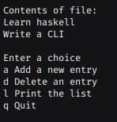

<div align = "center">

<h1><a href="https://2kabhishek.github.io/listmaker.hs">listmaker.hs</a></h1>

<a href="https://github.com/2KAbhishek/listmaker.hs/blob/main/LICENSE">
 </a>

<a href="https://github.com/2KAbhishek/listmaker.hs/pulse">
 </a>

<a href="https://github.com/2KAbhishek/listmaker.hs/stargazers">
</a>

<a href="https://github.com/2KAbhishek/listmaker.hs/network/members">
 </a>

<a href="https://github.com/2KAbhishek/listmaker.hs/watchers">
 </a>

<a href="https://github.com/2KAbhishek/listmaker.hs/graphs/contributors">
 </a>

<a href="https://github.com/2KAbhishek?tab=followers">
 </a>

<h3>Make lists with Haskell ✅🔢</h3>

<figure>
  
  <br/>
  <figcaption>listmaker.hs screenshot</figcaption>
</figure>

</div>

## What is this

listmaker.hs is a utility that allows you to create and maintain lists from the cli.
Uses text files for storing lists, has CRUD capabilities, and is very simple to use.

## Inspiration

Was learning Haskell, wanted to make a quick utility to manage my todo lists.

## Prerequisites

Before you begin, ensure you have met the following requirements:

- You have installed the latest version of `ghc`

## Getting listmaker.hs

To install listmaker.hs, follow these steps:

```bash
git clone https://github.com/2kabhishek/listmaker.hs
cd listmaker.hs
touch list.txt # Create a new list file e.g todo.md
ghc listmaker.hs # Compile the program
./listmaker list.txt # Run the program
```

## Using listmaker.hs

The commands are displayed after running the program.
You can use it on any text file.

## How it was built

listmaker.hs was built using `vim`, and `ghc`.

## Challenges faced

- Wrapping my head around some Haskell concepts was tricky.

## What I learned

- Learned Haskell basics by building.
- Learned about the Haskell toolchain.
- File IO in Haskell.

Hit the ⭐ button if you found this useful.

## More Info

<div align="center">

<a href="https://github.com/2KAbhishek/listmaker.hs">Source</a> | <a href="https://2kabhishek.github.io/listmaker.hs">Website</a>

</div>
